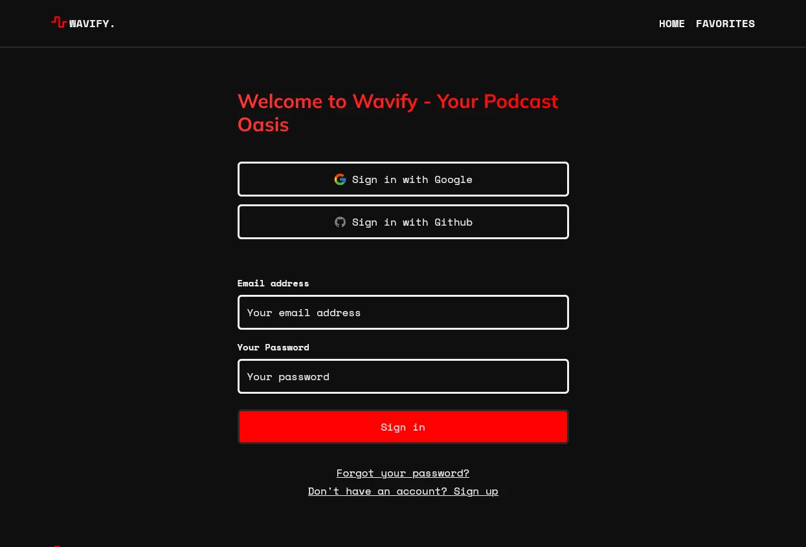
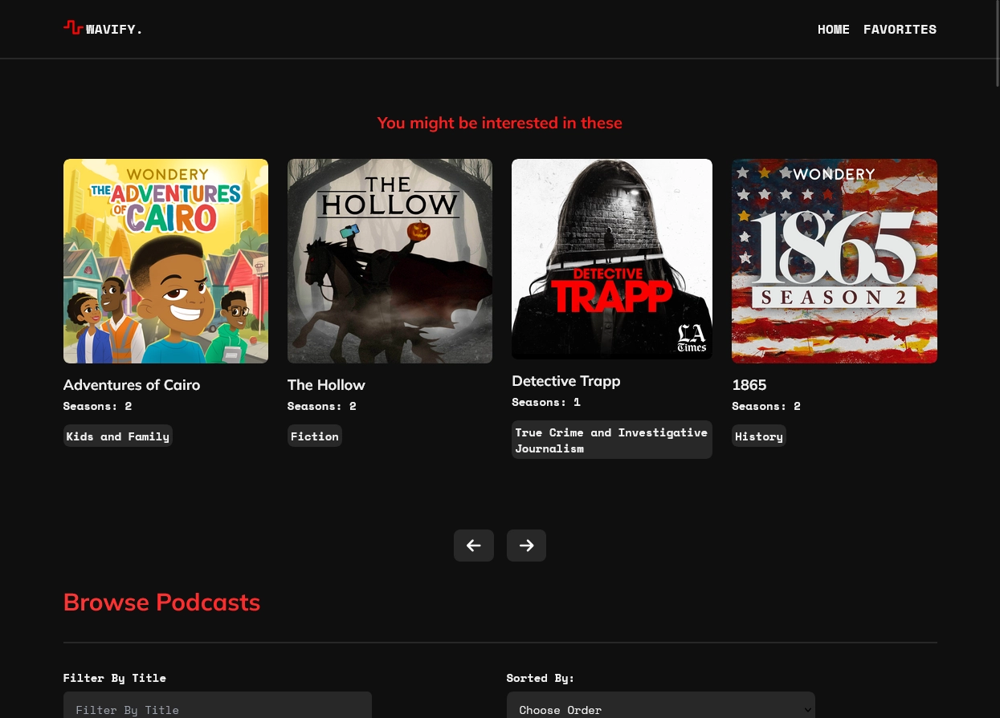
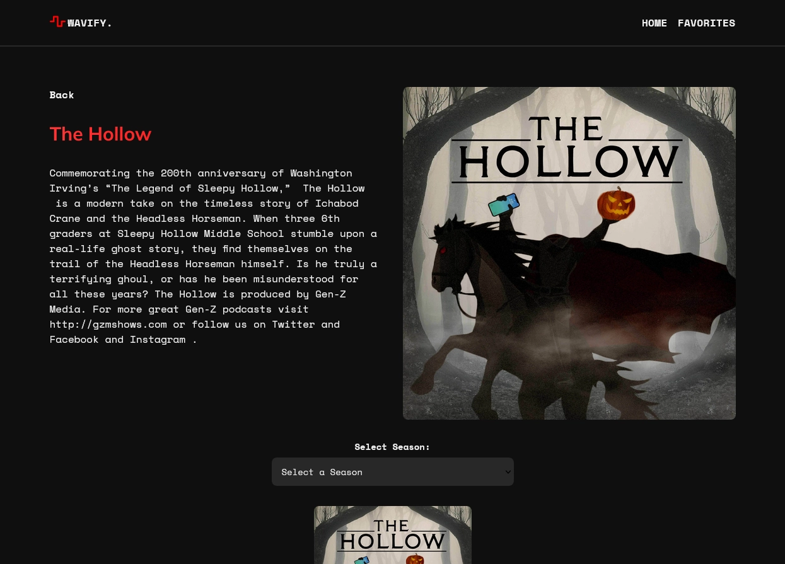
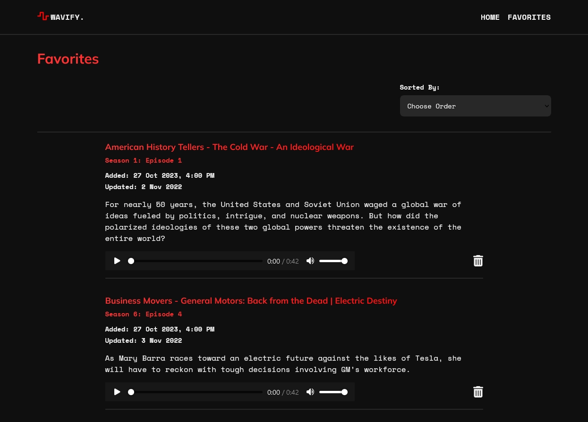

# Wavify - Podcast App

[](https://app.netlify.com/sites/wavifypodcast/deploys)

Wavify is a podcast app that allows users to login, browse various podcast shows, play episodes, and track their favorite episodes.

wavifypodcast -
[https://wavifypodcast.netlify.app/](https://wavifypodcast.netlify.app/)

## Table of Contents

- [Wavify - Podcast App](#wavify---podcast-app)
  - [Table of Contents](#table-of-contents)
    - [Login Auth Page Design](#login-auth-page-design)
    - [Home Page Design](#home-page-design)
    - [Podcast Page Design](#podcast-page-design)
    - [Favorites Page Design](#favorites-page-design)
  - [Features](#features)
  - [Installation](#installation)

### Login Auth Page Design



### Home Page Design



### Podcast Page Design



### Favorites Page Design



## Features

- **User Authentication with Supabase**: Allow users to securely log in and out of the app using Supabase authentication.
- **Dynamic Episodes Management**: Utilize the power of Supabase database for displaying, updating, and deleting podcast episodes, providing users with a seamless and real-time experience.
- **Browse Podcast Shows**: Explore a wide range of podcast shows with detailed information.
- **Play Episodes**: Listen to podcast episodes directly within the app.
- **Track Favorites**: Mark your favorite episodes and save them for later.
- **User-Friendly Interface**: A responsive and intuitive user interface for an enhanced experience.

## Installation

To get started with Wavify, follow these simple steps:

1. Clone the repository:

   ```bash
   git clone https://github.com/yourusername/Wavify.git
   cd Wavify
   ```

2. Install project dependencies using npm:

   ```bash
   npm install
   ```

3. After installing the necessary dependencies, you can start the development server using the following command:

   ```bash
   npm run dev
   ```

   **Author:** Dylan Gangat 🙋‍♂️

   Thank you for using Wavify! If you have any questions or need assistance, please don't hesitate to contact me. Happy podcasting! 🎧🎙️
